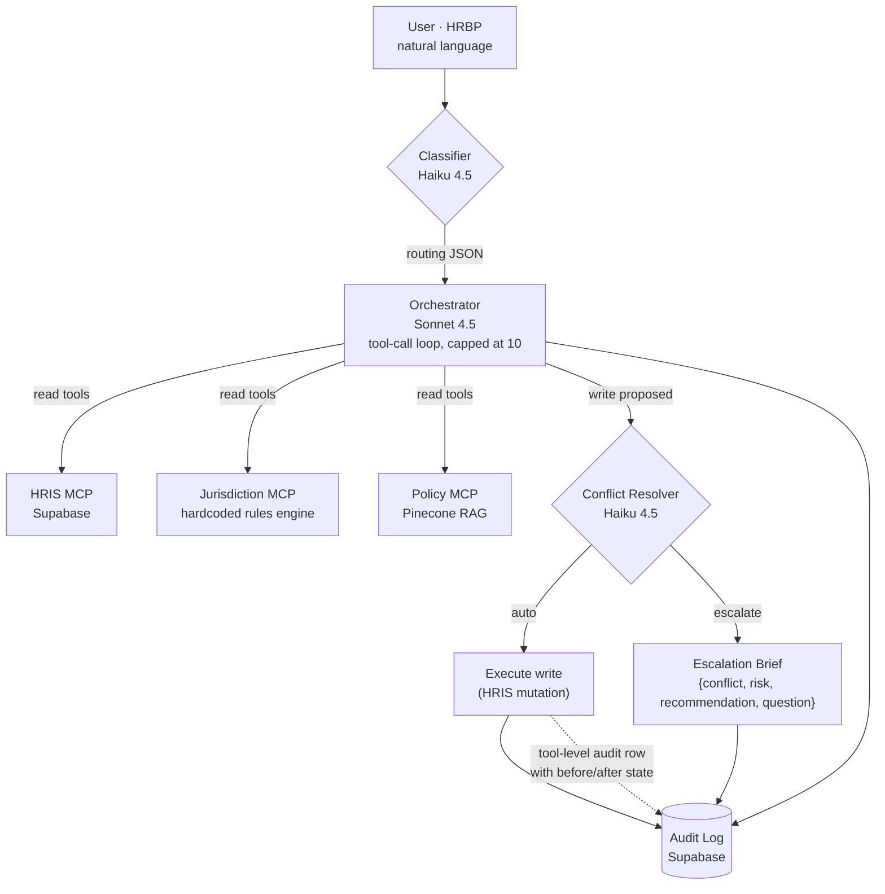

# HR Operations Agent

[](https://github.com/lucaslimaa2/hr-operations-agent/actions/workflows/ci.yml)
[](LICENSE)
[](https://www.python.org/downloads/release/python-3120/)

Handles HR workflow requests in natural language. Haiku classifies the intent, Sonnet reasons over three MCP servers (HRIS, jurisdiction rules engine, policy RAG), a conflict resolver gates every write, and every action is audit-logged.

Built as part of [Lucas Lima's Data & AI portfolio](https://lucaslima.xyz/ai-portfolio).

**Live demo:** [hr-agent.lucaslima.xyz](https://hr-agent.lucaslima.xyz)

---

## What this is

The user is an HRBP. They type a request like *"Terminate Sarah Chen with 2 weeks notice"* or *"What's our offboarding policy for Germany?"*, and the system:

1. Classifies the intent and routes to the right backends (Haiku, ~$0.003/call)
2. Reasons with Sonnet over a discoverable set of tools provided by three MCP servers
3. Gates any mutation through a Haiku-based conflict resolver. The write either executes or returns a structured escalation brief.
4. Records every request in an audit log with full tool-call trace and per-request cost

### What's mocked vs what's real

| Mocked | Real |
|---|---|
| 20 synthetic employees in Supabase (not a real Workday) | Live Claude API (Sonnet 4.5 + Haiku 4.5) |
| Hardcoded jurisdiction rules in Python (not a real Deel/Remote.com integration) | Live Supabase Postgres for `employees` + `audit_log` |
| HR policies written as markdown handbook prose (not a Notion/Confluence sync) | Live Pinecone vector store with OpenAI embeddings |
|  | Live SSE streaming, live prompt caching, live rate limiting |
|  | Real audit log with cost tracking and four queryable SQL views |

The mocks are at the data layer. Swapping any of them for the real backend (Workday, Deel, Notion API) is a config change in the relevant MCP server; the orchestrator, classifier, resolver, audit log, UI, and tests don't change.

---

## Architecture



Each MCP server runs as its own subprocess. The orchestrator launches them per request, discovers their tools at runtime, and forwards Sonnet's tool calls over the MCP protocol.

---

## Design notes

Labor-law rules live as hardcoded Pydantic models in `mcp_servers/jurisdiction_rules.py`, sourced from primary statutes (Lei 12.506/2011, BGB §622, Cal. Lab. Code §201/§203, federal WARN). The orchestrator queries the engine; it does not reason about compliance from training data. Countries outside the covered set return a structured `{covered: false, message, recommendation}` response. [ADR-0001](docs/adr/0001-bounded-jurisdiction-coverage.md) documents why JP and IN are explicitly out of scope.

Model choice is split for cost. Haiku for routing (~$0.003 per call), Sonnet for reasoning (~$0.015 to $0.040), Haiku again for the conflict resolver. Routing with Sonnet would cost 3-5x for the same outcome.

Writes go through a gate. The orchestrator routes any call in `WRITE_TOOLS` to a Haiku conflict resolver, which returns `auto` to execute or `escalate` with a structured brief. Four redundant logs capture every write: the orchestrator's system prompt, the resolver, the write tool's before/after row, and the per-request audit row.

Tools sit behind the MCP protocol contract, not in the agent. Each server is one deployable unit; the agent layer does not know whether the backing data is a Supabase table or a live Deel API. On long-running hosts (Railway, Fly.io, local dev) the servers run as subprocesses over stdio. On Vercel, where subprocess spawning is unreliable across cold starts, the orchestrator detects `VERCEL=1` and routes through an in-process adapter that calls the same FastMCP functions directly. Same tool names, same schemas, same return shapes.

---

## Stack

- **Python 3.12** managed with [`uv`](https://docs.astral.sh/uv/)
- **Anthropic SDK**: Claude Sonnet 4.5 (orchestrator, conflict resolver), Claude Haiku 4.5 (classifier, conflict resolver)
- **MCP Python SDK**: three servers, stdio transport
- **Supabase**: Postgres for `employees` + `audit_log`
- **Pinecone**: vector store for policy RAG (1536-dim, cosine, serverless)
- **OpenAI**: `text-embedding-3-small` for embeddings (client-side, swappable)
- **FastAPI**: `/api/chat` + `/api/chat/stream` (SSE)
- **Vanilla HTML/CSS/JS**: chat UI, no framework
- **Vercel**: deployment

---

## Jurisdiction coverage

| Country | Employment types | Source |
|---|---|---|
| Brazil (BR) | CLT (registered), PJ (contractor) | CLT, Lei 12.506/2011, Lei 8.036/1990, ADCT Art. 10 |
| Germany (DE) | full-time (probation + post-probation) | BGB §622, KSchG, BetrVG, MuSchG, SGB IX |
| California (US-CA) | full-time | Cal. Lab. Code §201/§202/§203/§2922, §§1400–1408 (Cal-WARN), federal WARN |
| United Kingdom (UK) | full-time | ERA 1996 §86, §§94–98, §§135, 162; TULRCA 1992 §188; PIDA 1998; Equality Act 2010 |
| France (FR) | non-cadre, cadre | Code du travail Art. L1234-1, L1234-9, L1233-61 (PSE), L1235-3 (barème Macron); applicable CCN |
| Spain (ES) | full-time | Estatuto de los Trabajadores Art. 51, 53, 56; Ley 36/2011 (LRJS) |
| Italy (IT) | full-time (impiegato default) | Codice Civile Art. 2118 (notice), Art. 2120 (TFR); Legge 223/1991 (collective dismissal); Jobs Act D.Lgs. 23/2015 |
| Singapore (SG) | full-time | Employment Act (Chapter 91) §10, §11, §22, §43; MOM Tripartite Advisory; Workplace Fairness Act 2025 |
| South Africa (ZA) | full-time | BCEA §37, §41 (severance); LRA §188, §189, §189A (large-scale), §187 (automatically unfair); CCMA jurisdiction |
| Texas (US-TX) | full-time | Texas Labor Code §61 (Payday Law), Chapter 21 (TCHRA); federal WARN (no state WARN supplement); Sabine Pilot doctrine |
| New York (US-NY) | full-time | NY Labor Law §191, §198, §740, §860 et seq. (NY WARN, broader than federal); NYSHRL; NYC HRL |

Other countries return a structured *"not covered, recommend legal review"* response. Japan and India in particular are deliberately out of scope: `docs/jurisdiction.md` includes dedicated sections explaining the regulatory landscape (Japan's LCA Art. 16 just-cause doctrine and seiri kaiko four-factor case-law test; India's State-by-State Shops Acts, IDA workman classification, establishment-size thresholds, and the partial-notification status of the 2019/2020 Labor Codes) and why neither admits a safe deterministic rule. Phase 8 complete.

---

## Demo scenarios

The system handles all of these end-to-end:

1. *"What's the minimum notice period to terminate someone in Germany?"* : jurisdiction only
2. *"Process termination for João, last day Jan 31."* : HRIS + jurisdiction (BR CLT, 5+ years)
3. *"Terminate Ana Müller with 2 weeks notice."* : HRIS + jurisdiction confirms compliant (DE probation, BGB §622(3))
4. *"Terminate Sarah Chen with 2 weeks notice."* : HRIS + jurisdiction flags non-compliant (DE 6+ years, BGB §622(2) requires 60 days)
5. *"Convert Maria Santos from contractor to CLT."* : all three servers (HRIS lookup, conversion policy, vínculo empregatício re-classification risk)
6. *"What severance is Carlos entitled to?"* : HRIS + jurisdiction (ES despido objetivo, 20 days per year of service)
7. *"What are our offboarding steps?"* : policy only
8. *"Lay off 60 people at our 200-employee California office."* : Cal-WARN trigger demonstration

---

## Observability

Every request writes one row to the Supabase `audit_log` table with the full tool-call trace, agents invoked, cost in USD, resolution (`auto` / `escalate` / `write` / `truncated`), and the `escalated` flag. The audit log isn't write-only; it's queryable.

[`db/cost_dashboard.sql`](db/cost_dashboard.sql) defines four reusable Postgres views you can paste into Supabase:

| View | Query shape |
|---|---|
| `daily_cost` | spend + request counts + escalation rate per day |
| `session_summary` | aggregate per chat session, cost, requests, agents invoked |
| `agent_usage` | invocation count + attributed cost per MCP server |
| `recent_escalations` | the last 50 escalated requests with full context |

Example: `SELECT * FROM daily_cost LIMIT 7;` shows the past week of spend, escalations, and cap-truncations at a glance.

---

## Verifying correctness

Three isolated test scripts, each runnable independently:

```bash
uv run python scripts/test_jurisdiction.py   # 36 scenarios, rules engine
uv run python scripts/test_classifier.py     # 7 scenarios, Haiku routing
uv run python scripts/test_resolver.py       # 6 scenarios, auto/escalate decisions
```

---

## Project structure

```
agent/
├── classifier.py            # Haiku: routing decision (JSON via forced tool call)
├── orchestrator.py          # Sonnet: tool-call loop, MCP client, write-gating
├── conflict_resolver.py     # Haiku: write gating, structured escalation brief
└── audit.py                 # Supabase audit_log writer

mcp_servers/
├── jurisdiction_rules.py    # Pure data: Pydantic models + hardcoded rules
├── jurisdiction_server.py   # FastMCP server: get_notice_period, get_termination_rules, validate_action
├── hris_server.py           # FastMCP server: get_employee, search_employees, get_payroll_calendar, update_employment_status
└── policy_server.py         # FastMCP server: search_policies, get_policy

api/
└── index.py                 # FastAPI: /api/ping, /api/chat, /api/chat/stream (SSE)

public/
├── index.html               # Chat UI
├── style.css                # Inter + Playfair Display, light theme
└── app.js                   # SSE consumer, agent pills, tool chips, escalation card

scripts/
├── smoke_test.py            # Ping all four external services
├── seed_data.py             # Seed 20 mock employees into Supabase
├── seed_policies.py         # Chunk + embed + upsert to Pinecone
├── test_jurisdiction.py     # 36 isolated rules-engine scenarios
├── test_classifier.py       # 7 routing scenarios
└── test_resolver.py         # 6 conflict-resolver scenarios

docs/
├── jurisdiction.md          # Labor-law reference, every rule cited to primary statute
├── adr/                     # Architecture Decision Records (ADR-0001: bounded coverage)
└── policies/                # 5 HR handbook markdown docs (offboarding, conversion, comp bands, etc.)

db/
└── schema.sql               # Supabase schema (employees, audit_log)
```

---

## License

MIT, see [LICENSE](LICENSE).

---

Built by [Lucas Lima](https://lucaslima.xyz). Synthetic employees and policies; not a real HR system.
