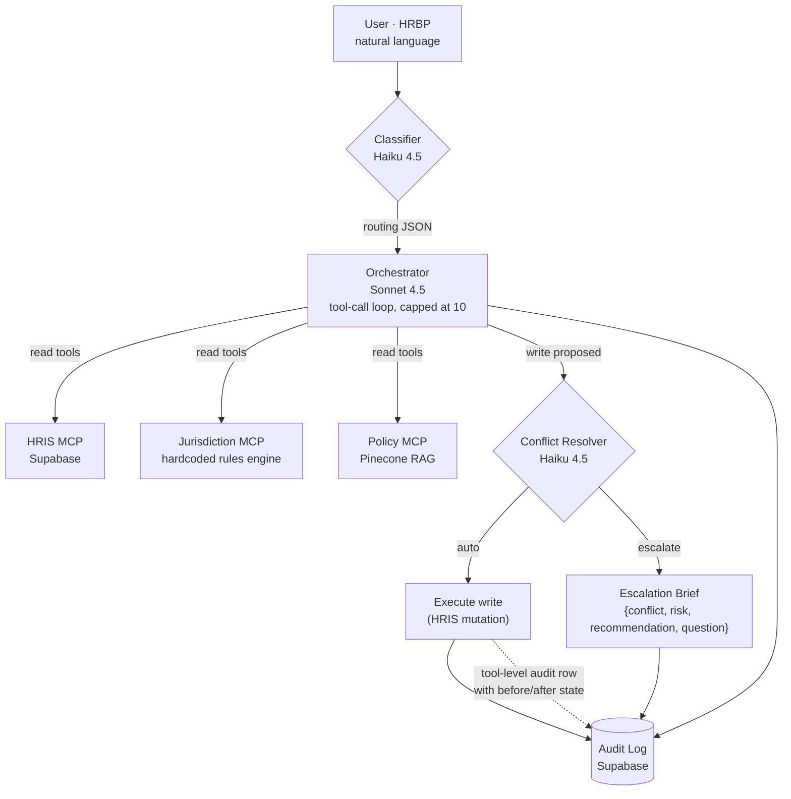

# HR Operations Agent

[](https://github.com/lucaslimaa2/hr-operations-agent/actions/workflows/ci.yml)
[](LICENSE)
[](https://www.python.org/downloads/release/python-3120/)

A production-shaped multi-agent system that handles HR workflow requests in natural language. Haiku classifies the intent, Sonnet reasons over three MCP servers (HRIS, jurisdiction rules engine, policy RAG), a conflict resolver gates every write, and every action is audit-logged.

Built as part of [Lucas Lima's AI portfolio](https://lucaslima.xyz/ai-portfolio).

**Live demo:** [hr-operations-agent-iota.vercel.app](https://hr-operations-agent-iota.vercel.app)

---

## What this is

The user is an HRBP. They type a request like *"Terminate Sarah Chen with 2 weeks notice"* or *"What's our offboarding policy for Germany?"* — the system:

1. Classifies the intent and routes to the right backends (Haiku, ~$0.003/call)
2. Reasons with Sonnet over a discoverable set of tools provided by three MCP servers
3. Gates any mutation through a Haiku-based conflict resolver — writes either execute or produce a structured escalation brief
4. Records every request in an audit log with full tool-call trace and per-request cost

The architecture is the point. The MCP boundary, the classifier/orchestrator split, the deterministic compliance engine, the write-gating layers — all production-grade patterns scaled down to a single demo.

---

## Architecture



Each MCP server runs as its own subprocess. The orchestrator launches them per request, discovers their tools at runtime, and forwards Sonnet's tool calls over the MCP protocol. **Swapping a mock for a real backend (Workday, Deel, Notion) is a config change, not a rewrite — that's the property the architecture buys you.**

---

## Why this is interesting

**1. Deterministic compliance, not LLM-inferred.**
Labor-law rules live as hardcoded structured data in `mcp_servers/jurisdiction_rules.py`, sourced from primary statutes (Lei 12.506/2011, BGB §622, Cal. Lab. Code §201/§203, federal WARN). The LLM never reasons about compliance from training data — it queries the rules engine. Uncovered countries return a structured *"not covered, escalate"* response. Never a guess.

**2. Cost discipline as architecture.**
Routing is a Haiku call (~$0.003). Reasoning is Sonnet (~$0.015–0.040 per request, depending on tool calls). Conflict resolution is Haiku (~$0.003). Using Sonnet for routing would 3–5× the cost with no quality gain — the split is intentional.

**3. Write-gating via deterministic mechanism, not LLM judgment.**
The orchestrator intercepts any tool in `WRITE_TOOLS` and routes it through the conflict resolver. The resolver returns `auto` or `escalate` with a structured brief. The write tool literally cannot fire without resolver approval — this is structural, not advisory.

**4. Four layered safety mechanisms for writes.**
- Sonnet's system prompt refuses non-compliant writes (first line)
- The orchestrator's conflict resolver gates structurally (second line)
- The write tool itself logs a before/after audit row before returning (defense even if the first two fail)
- The orchestrator writes a per-request audit row capturing the full sequence

**5. MCP boundary, not framework lock-in.**
Tools are MCP servers — separate logical units with a defined protocol contract. Each server is a deployable unit: same interface whether the backing data is a Python dict, a Supabase table, or a live Deel API. The agent layer is vendor-agnostic by construction.

**Transport adapts to the runtime.** On long-running hosts (Railway, Fly.io, local dev), MCP servers run as **subprocesses** communicating via stdio — true process isolation. On Vercel's serverless runtime, where subprocess spawning is unreliable across cold starts, the orchestrator detects `VERCEL=1` and switches to an **in-process adapter** that calls the FastMCP tool functions directly via the same `list_tools()` / `call_tool()` contract. Tool names, schemas, arguments, return shapes — all identical. Only the wire changes.

---

## Status

| Phase | What | Status |
|---|---|---|
| 0 | Project setup, env, schema, smoke test | ✅ |
| 1 | Jurisdiction research — `docs/jurisdiction.md` (BR CLT/PJ, DE, US-CA) | ✅ |
| 2 | Jurisdiction MCP server | ✅ |
| 3 | Classifier + Orchestrator + FastAPI + UI + Vercel deploy | ✅ |
| 4 | HRIS MCP server + 20 seeded employees | ✅ |
| 5 | Policy RAG server (5 docs, Pinecone, structural chunking) | ✅ |
| 6 | Conflict resolver + write gating + escalation UI | ✅ |
| 7 | UI polish | ⏳ |
| 8 | Expand jurisdiction to 13 countries | ⏳ |
| 9 | Hardening: rate limit, prompt caching, CI | ⏳ |
| 10 | Custom domain, portfolio launch | ⏳ |

Full phase plan in [`docs/roadmap.md`](docs/roadmap.md).

---

## Stack

- **Python 3.12** managed with [`uv`](https://docs.astral.sh/uv/)
- **Anthropic SDK** — Claude Sonnet 4.5 (orchestrator, conflict resolver), Claude Haiku 4.5 (classifier, conflict resolver)
- **MCP Python SDK** — three servers, stdio transport
- **Supabase** — Postgres for `employees` + `audit_log`
- **Pinecone** — vector store for policy RAG (1536-dim, cosine, serverless)
- **OpenAI** — `text-embedding-3-small` for embeddings (client-side, swappable)
- **FastAPI** — `/api/chat` + `/api/chat/stream` (SSE)
- **Vanilla HTML/CSS/JS** — chat UI, no framework
- **Vercel** — deployment

---

## Jurisdiction coverage (Phase 6)

| Country | Employment types | Source |
|---|---|---|
| Brazil (BR) | CLT (registered), PJ (contractor) | CLT, Lei 12.506/2011, Lei 8.036/1990, ADCT Art. 10 |
| Germany (DE) | full-time (probation + post-probation) | BGB §622, KSchG, BetrVG, MuSchG, SGB IX |
| California (US-CA) | full-time | Cal. Lab. Code §201/§202/§203/§2922, §§1400–1408 (Cal-WARN), federal WARN |

Other countries return a structured *"not covered — recommend legal review"* response. **Phase 8** expands to IT, FR, UK, ES, SG, ZA, US-TX, US-NY, with JP and IN remaining as graceful-fallback tests.

---

## Demo scenarios

The system handles all of these end-to-end:

1. *"What's the minimum notice period to terminate someone in Germany?"* — jurisdiction only
2. *"Process termination for João, last day Jan 31."* — HRIS + jurisdiction (BR CLT, 5+ years)
3. *"Terminate Ana Müller with 2 weeks notice."* — HRIS + jurisdiction confirms compliant (DE probation, BGB §622(3))
4. *"Terminate Sarah Chen with 2 weeks notice."* — HRIS + jurisdiction flags non-compliant (DE 6+ years, BGB §622(2) requires 60 days)
5. *"Convert Maria Santos from contractor to CLT."* — all three servers (HRIS lookup, conversion policy, vínculo empregatício re-classification risk)
6. *"What severance is Carlos entitled to?"* — HRIS + jurisdiction (ES — currently returns "not covered" until Phase 8)
7. *"What are our offboarding steps?"* — policy only
8. *"Lay off 60 people at our 200-employee California office."* — Cal-WARN trigger demonstration

---

## Quickstart

```bash
git clone https://github.com/lucaslimaa2/hr-operations-agent.git
cd hr-operations-agent
uv sync

cp .env.example .env  # fill in your keys

# One-time setup — apply schema via Supabase SQL editor (db/schema.sql)
# Create Pinecone index 'hr-policies' (1536 dims, cosine, serverless)

# Smoke test all four services
uv run python scripts/smoke_test.py

# Seed mock employees + policy corpus
uv run python scripts/seed_data.py
uv run python scripts/seed_policies.py

# Run the agent end-to-end from CLI
uv run python -m agent.orchestrator "What's the minimum notice in Germany?"

# Or run the full app (UI + API) locally
uv run uvicorn api.index:app --host 127.0.0.1 --port 8000
# open http://127.0.0.1:8000
```

---

## Observability

Every request writes one row to the Supabase `audit_log` table — full tool-call trace, agents invoked, cost in USD, resolution (`auto` / `escalate` / `write` / `truncated`), and the `escalated` flag. The audit log isn't write-only; it's queryable.

[`db/cost_dashboard.sql`](db/cost_dashboard.sql) defines four reusable Postgres views you can paste into Supabase:

| View | Query shape |
|---|---|
| `daily_cost` | spend + request counts + escalation rate per day |
| `session_summary` | aggregate per chat session — cost, requests, agents invoked |
| `agent_usage` | invocation count + attributed cost per MCP server |
| `recent_escalations` | the last 50 escalated requests with full context |

Example: `SELECT * FROM daily_cost LIMIT 7;` shows the past week of spend, escalations, and cap-truncations at a glance.

---

## Verifying correctness

Three isolated test scripts, each runnable independently:

```bash
uv run python scripts/test_jurisdiction.py   # 12 scenarios — rules engine
uv run python scripts/test_classifier.py     # 7 scenarios — Haiku routing
uv run python scripts/test_resolver.py       # 6 scenarios — auto/escalate decisions
```

These exist so any layer's correctness can be defended in isolation, separate from the end-to-end agent flow.

---

## Project structure

```
agent/
├── classifier.py            # Haiku — routing decision (JSON via forced tool call)
├── orchestrator.py          # Sonnet — tool-call loop, MCP client, write-gating
├── conflict_resolver.py     # Haiku — write gating, structured escalation brief
└── audit.py                 # Supabase audit_log writer

mcp_servers/
├── jurisdiction_rules.py    # Pure data — Pydantic models + hardcoded rules
├── jurisdiction_server.py   # FastMCP server: get_notice_period, get_termination_rules, validate_action
├── hris_server.py           # FastMCP server: get_employee, search_employees, get_payroll_calendar, update_employment_status
└── policy_server.py         # FastMCP server: search_policies, get_policy

api/
└── index.py                 # FastAPI — /api/ping, /api/chat, /api/chat/stream (SSE)

public/
├── index.html               # Chat UI
├── style.css                # Inter + Playfair Display, light theme
└── app.js                   # SSE consumer, agent pills, tool chips, escalation card

scripts/
├── smoke_test.py            # Ping all four external services
├── seed_data.py             # Seed 20 mock employees into Supabase
├── seed_policies.py         # Chunk + embed + upsert to Pinecone
├── test_jurisdiction.py     # 12 isolated rules-engine scenarios
├── test_classifier.py       # 7 routing scenarios
└── test_resolver.py         # 6 conflict-resolver scenarios

docs/
├── jurisdiction.md          # Authoritative labor-law reference (460 lines, every rule cited)
├── roadmap.md               # Phase-by-phase plan with status
└── policies/                # 5 HR handbook markdown docs (offboarding, conversion, comp bands, etc.)

db/
└── schema.sql               # Supabase schema (employees, audit_log)
```

---

## Cross-references

- [`CLAUDE.md`](CLAUDE.md) — original project spec and non-negotiable design rules
- [`docs/jurisdiction.md`](docs/jurisdiction.md) — labor-law reference, every rule cited to primary statute
- [`docs/roadmap.md`](docs/roadmap.md) — phase plan with current status and per-phase defensible decisions
- [`docs/policies/`](docs/policies/) — HR policy markdown corpus (5 docs)
- [`db/schema.sql`](db/schema.sql) — Postgres schema

---

## License

MIT — see [LICENSE](LICENSE).

---

Built by [Lucas Lima](https://lucaslima.xyz). Synthetic employees and policies; not a real HR system.
